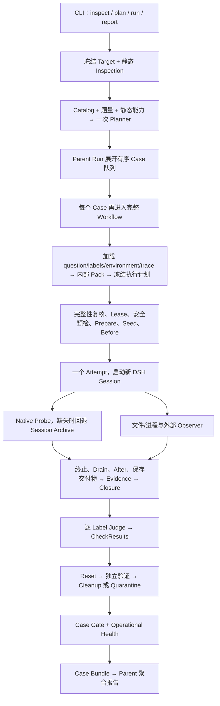

# DSHEval 第一轮架构与流程审阅

> 后续设计已确认，Trace/Loader 已有修复。最新约定和验证见 [DECISIONS-20260911.md](./DECISIONS-20260911.md)。本文件保留首次审阅发现，原建议不等于当前实施要求。

审阅日期：2026-09-11。执行位置：VMmac `/Users/dsheval/Projects/dsheval`。
基线：Git HEAD `09e5761`，以现有未提交工作区为实际审阅对象；已有修改没有回退或覆盖。
性质：实现事实、验证结果与待确认设计的交接记录；本轮不实施业务重构。

## 1. 结论与覆盖范围

当前项目是 TypeScript 模块化单体，评测对象为完整 DSH Agent。核心方向成立：统一规划、逐题执行、内部 Trace 与外部证据分开、按标签判定、Agent 结论与基础设施健康分开。

主要矛盾是多次迭代产生的契约不同步：题库作者格式与 Loader 不一致、Parent Run 与旧单 Run 内核并存、观测状态与完整性不同步、领域记录与展示用结果包并存。重构应先恢复语义和证据可靠性，再拆分大文件。

范围：

- 阅读 README、架构/契约/调试文档和生产 CLI、Batch、完整单 Case 主链及异常路径。
- 核对 Planner、Dataset Loader、计划编译、Target 执行、Native/Session Trace、环境观测、Evidence/Closure/Judge/Gate、存储与报告导出关键实现。
- 检查测试约束、真实题库及两个历史运行结果。
- 源码统计：49 个 TypeScript 文件、27,770 行，排除生成的 lib 和 node_modules；另有 observer-lab MJS 与题库检查脚本。
- 未宣称逐行审核全部源码、所有题目语义或外部 DSH 包。未新增真实模型调用，未执行题库提交程序或私有 checker，未复跑真实 Agent。
- 构建与测试在 VM 执行；本轮只新增本报告和 var/reviews 审阅材料，没有修改业务源码或题目。

## 2. 按现有实现还原流程

真实调用关系：

1. `inspect` 冻结并读取 Target 静态信息，不调用规划模型。
2. `plan` 调用统一 Planner。STANDARD 是 1–4 个 Dataset、每个 2 题、总计最多 8 题。
3. 真实 `run` 先借用单题 Workflow 做一次 PLAN，然后复用选择结果运行每个 Case。Fixture 直接进入旧的单题 Workflow。
4. 队列按 Planner Dataset 顺序展开；每个 Dataset 按文件名排序取前 N 题，不是随机抽样。
5. Case 有独立内部 executionRunId，例如 parent.c1；因此底层仍是一个 Run/Case/Attempt 的对象图，Parent 是外层 Batch Summary。
6. 每个 Case 会重新 bootstrap、冻结/检查 Target、枚举 Catalog、加载资产；复用的是 DatasetSelection，不是完整冻结运行规格。
7. 每个 Case 一个 Attempt，不自动重试。标签来自该题 capabilityLabels；题目标签必须属于选中 Dataset 的 Catalog 标签集合。
8. 先形成证据，Closure 闭合后才真正调用 Judge。故“每标签一次”是正常闭合条件下的上限，BLOCKED 标签不调用模型。
9. Label Judge 返回 0–4 分；当前根据 passScore 转成 PASS/FAIL。所有题目绑定的标签均被 Loader 设置为 required/hardGate。
10. Case Gate 规则：hard FAIL 优先，其次 required UNEVALUABLE，否则 PASS；环境收尾失败单独影响 operationalHealth。
11. 成功导出后删除内部运行区；Parent 最后再写 run.json/report.html。

当前 Session 模式共享 `~/.dsh`，为了让会话出现在常驻 DSH UI；Workspace 与临时 Runtime Home 分题创建。Session 分离不等于文件系统隔离或全局环境复位。

## 3. 模块与资产的实际职责

| 层 | 当前职责 | 关键边界 |
|---|---|---|
| app | CLI、依赖装配、单题 Workflow、批处理 | workflow.ts 3,206 行，混有阶段编排、数据转换、保存与恢复 |
| core | 模型、Ref/摘要/Scope、Port、错误 | models.ts 1,625 行，是全系统共享模型中心 |
| planning | Target 冻结/静态检查、LLM Dataset 选择 | 静态能力是规划线索，不是已验证运行能力 |
| datasets | 描述目录、题目/公开输入、资产组合 | 产出内部 EvaluationPack，直接依赖 evaluation 编译与 Judge ID |
| runtime | 计划编译、环境生命周期、目标进程、Session 日志 | 部分规划职责位于 runtime；执行前安全预检才检查真实条件 |
| agent-trace | Native 插件及兼容协议适配 | 目标侧合作采集，不能视为独立可信事实 |
| observation | Before/After 文件与进程、Probe 标准化、lab 适配 | lab 有独立配置与子进程生命周期 |
| evaluation | Evidence、Closure、Judge、Gate、JSON/HTML 报告 | 报告投影与原始事实须有明确单向关系 |
| storage | JSON/JSONL、不可变记录、修订 CAS、Artifact | 已有摘要、Scope、授权与原子写入，应保留 |
| platform | 配置、安全、Lease、导出、Viewer | 当前 Case Bundle 重读报告视图，有新的事实丢失边界 |

外部配置至少有六组：datasets、labels、environments、trace、planning、config；另外 observer-lab/config 再定义组件实例。Dataset 负责“做什么”，Label 负责“测哪种能力及如何评分”，Environment/Observer 负责“环境事实怎么取得”。

目前最终结果正确性没有独立于 Label 的生产执行通道；私有参考和题目 evaluator 作为 ruleParameters 交给 LLM，不能等价为执行过确定性 checker。

## 4. 本轮验证

| 检查 | 结果 | 解释 |
|---|---|---|
| pnpm run check | 通过 | 当前工作区类型检查通过 |
| pnpm test | 104/104 通过，0 skipped | 包含构建，约 9.1 秒测试执行；不等价于真实模型与题库验收 |
| 遍历 Catalog 与题目并调用真实 Loader | 43 个 Dataset，173 题，113 题成功、60 题失败 | 49 题 setup 不支持，11 题缺少非空输入 sha256 |
| 至少 2 题可被 Loader 加载的 Dataset | 19 个 | 仅 Loader 层可用；未检查实际依赖、Observer 或 evaluator |
| Batch 失败场景隔离复现 | 失败诊断文件被删除，返回 recordsPath 不存在 | 使用注入的模拟 workflowRunner，无 Agent 执行 |
| Lease 隔离复现 | 两个目录同时拿到 vm-global | 没有占用正式运行目录的锁 |
| Trace 适配隔离复现 | 异常 Native 输入最终 COMPLETE、issues=[] | seq 缺口、无效 hash、仅 turn/start、无原生 stop |

机器可读材料在 `var/reviews/architecture-20260911/`：

- `tests.log`：完整测试输出。
- `asset-audit.mjs` / `asset-audit.json`：全题库 Loader 审核与每题失败原因。
- `reproduction.mjs` / `reproduction.json`：上述三个实现问题的独立复现。
- `historical-summary.json`：历史报告的受控摘要。

历史运行 `standard-e2e-20260910-1800` 实际计划 8 题、只执行 agentbench-os 的 2 题，结果 FAIL/PASS。两题都只保存了 Filesystem/Process 组件文件；这不能证明其他 Adapter 已端到端验收。两题压缩 Raw Trace 分别约 12.9 MB、8.4 MB。第一题 Trace 索引出现 private/final.json 引用，结合文档说明与共享身份配置，应把私有材料可见性视为真实边界问题；这里未将仅出现路径直接当作独立读取证明。

## 5. 优先问题与证据

### A. 证据完整性被兼容适配弱化（优先修复，已复现）

`src/agent-trace/native-probe-adapter.ts:153` 合并事件后去重并重新连续编号，没有校验原始 hash chain；缺失 Native stop 时补 probe/stop。
`src/observation/runtime.ts:663` 只检查存在某个 turn/start 或 turn/end，没有要求成对闭合。
`src/app/workflow.ts:1422` 与 `:1533` 没有把 Native 返回的 truncated 传到解析器；Session Archive 的 truncated 也在转换后丢失。

复现：seq=1,3、无效 hash、只有 turn/start 的输入，适配后仍判 COMPLETE，issues=[]。进程退出这一事实不能证明工具、Session flush 和原始数据完整。

建议：保留原序列/链完整性与采集缺口；区分 target termination、native flush、adapter boundary；不完整标志必须贯穿 Raw→CollectionStatus→Closure→Judge。

### B. 题库格式与 Loader 契约脱节（优先修复，已量化）

`src/datasets/evaluation-asset.ts:193` 只支持 shuffle-options/none；大量新题使用 copy-public-inputs。11 题在输入 sha256 处已失败。
`src/app/workflow.ts:632` 只数 question.json；`:694` 对多题 plan 提前成功返回，没逐题加载和编译。
`src/planning/planner.ts` 的 Eligibility 将候选统一描述为 CONDITIONAL。

因此 104 项测试通过、Planner 成功和题目可运行是三个不同事实。一个缺题 Catalog 项还会直接让整个枚举 Promise.all 抛错，而非排除该候选。

建议：建立无执行副作用的统一资产校验/能力预检，生成显式 READY/BLOCKED 及原因，Planner 仅接收 READY Case 集合。

### C. 最终结果 Gate 与能力评分混在一起（设计必须确认）

`src/datasets/evaluation-asset.ts:333` 仅把参考 answer/rubric/evaluator 放入 Judge 参数；`:370` 仍硬编码 output 路径策略。
`src/evaluation/llm-label-judge.ts:141` 仅按 score >= passScore 判 PASS。
例如 featurebench 新题有 checks/check.py、隐藏测试与 resultGate，但作者 README 明确说明 prototype-not-integrated；当前主链没有执行 checker。

还存在题目允许 work/**、Loader 却只允许 output 的冲突。即使只补 setup 支持，这些题的验收语义仍未完成接入。

建议：把 TaskResultCheck（确定性检查/必要的结果 Judge）、CapabilityScore、EvidenceHealth 分开；明确最终 Gate 如何组合。改编题标明 bounded-slice/major-scope-change，不能报告为原 Benchmark 完整复现。

### D. Batch 删除失败现场（优先修复，已复现）

`src/app/batch.ts:286` 无条件删除 transientRoot。没有 Case Bundle 的失败 Case 也随之丢失 records/artifacts；summary 可能返回已删除的路径。该删除也绕过“Quarantine 保留待恢复现场”的预期。

建议：只在完整归档且可校验后逐项 GC；失败/隔离记录持久保存；Parent 无 Bundle 也必须有稳定的失败清单。

### E. vm-global 锁不是 VM 全局（优先修复，已复现）

`src/platform/services.ts:95` 把 active-run.lock 放在 runRoot；`src/app/batch.ts:221` 每 Case 更换 runRoot。
两个批次可分别拿到同名 vm-global，串行只在单 Batch 内成立。当前又共享 DSH Home 和整台机器环境，可能相互污染。

建议：把 VM Lease 放在配置的固定控制目录，由 Parent 持有到全部 Case 收尾；Case 存储隔离与资源互斥分别建模。

### F. Observer 运行状态、完整性和导出不一致（代码确认）

`src/observation/lab.ts:143` complete 只看进程退出码；`:322` 即使 runtimeStatus=PARTIAL/NOT_CONFIGURED，只要 code=0，CollectionStatus.completeness 仍为 COMPLETE。
`observer-lab/bin/observer-smoke.mjs:110` 用最后一次采样状态形成整窗总结，可能掩盖中途失败。
`src/platform/case-bundle.ts:344` 仅从变化事件创建组件文件，零事件时缺少独立组件状态文件。
`src/observation/lab.ts:120` 停止仅 SIGTERM 等待退出，没有兜底升级超时。

建议：Coverage 汇总整个窗口；空但完整、未配置、失败、未启动分开；不依赖事件数保存状态；每类 Observer 明确哪些能力是 required、哪些只是补充事实。

### G. 冻结计划没有覆盖实际评分规则（代码确认）

`src/evaluation/llm-label-judge.ts:61` Judge capabilityDigest 仅覆盖 ID/版本/类型，没覆盖评分标准和提示词。
`:200` 执行 Judge 时重新读取 Label 文件；运行期间文件变化不会被原计划阻止。
`src/app/workflow.ts:1804` 创建默认 Judge Factory 时未传入 input.labelsRoot；`llm-label-judge.ts:263` 使用环境变量或 cwd/labels。CLI --labels 指定的规划目录可能与实际评分目录不同。

建议：RunSpecification 一次冻结完整 Label/Judge 资产和模型配置摘要，执行阶段只使用已冻结资产；路径解析集中一次完成。

### H. Parent Run 只是外层摘要（架构债务，代码确认）

Parent 复用 DatasetSelection，每 Case 却重新冻结 Target 与配置。Target/Label/题库在长批次期间变化时，不保证所有题评测同一快照；父 target.json 又保留首次写入结果。
批次中断前 Parent 汇总不持续提交，报告在 Case 完成和 Parent 完成之间存在两种状态语义。

建议：Parent 是真正的一次评测运行；所有 Case 绑定同一 RunSpecification，Case/Attempt 独立状态，Parent 显式保存 planned/executed/skipped/aborted 与完成度。

### I. 结果包依赖展示视图，削弱可重放性（代码确认）

`src/platform/case-bundle.ts:250` 读取 report.view 再拼 task/plan/evidence/judge。
`src/evaluation/report.ts:208` 已把 PROTOCOL_LIFECYCLE 投影为摘要，导出的“authorizedEvidence”不完全等于实际 Judge 输入。
Batch 删除原领域记录后，旧 report 命令仍从 reportRoot/runId/report.json 读取原格式，不能直接把 Parent Bundle 当作原权威报告重建。

建议：Bundle 从已提交领域快照直接生成，封存实际 Judge 输入/输出、规则摘要与完整引用；HTML 由 Bundle 渲染。明确哪个 JSON 是权威格式及迁移版本。

### J. Session 隔离、Workspace Reset 与真实能力边界（设计确认）

当前 minimumIsolationLevel=SESSION_SEPARATED；targetIdentity 声明 dshagent，但执行走控制器用户并共享 DSH Home。
Reset 主要清空/验证 Workspace，不能证明浏览器、数据库、全局进程、网络服务或 DSH 记忆复原。
Bootstrap 的 planningCapabilities 当前固定标 true，不能作为真实隔离已经建立的依据。

建议：若目标是可信成绩，至少分离被测身份、私有评分区、Observer/Judge；将“会话可在 UI 查看”和“使用共享可写 Home”拆开。选择独立 OS 用户还是每 Case VM 恢复，要由期望隔离等级与耗时决定。

## 6. 建议保留与调整的架构

保留模块化单体，不急于微服务或并行。保留 Ref/Scope/摘要、不可变存储、证据闭合和三值 Gate；这些是已有的有效基础。

建议主模型：

- TargetSnapshot：一次 Parent Run 的实际被测 Agent 基线。
- DatasetDefinition / CaseDefinition：统一版本化的题目、公开输入、准备方式、结果检查与标签绑定。
- RunSpecification：冻结 Target、选题清单、资产摘要、Judge 配置、环境需求、预算与抽样种子。
- CaseExecution / Attempt：只负责执行当前冻结题，接收 Observer/Target 接口，不再重新选择与加载动态规则。
- ObservationCapture：原始事实、采集状态、缺口、来源完整性与时间窗口。
- TaskResult + LabelAssessment：分别回答“题目是否完成”和“能力表现如何”。
- ResultBundle：完整领域结果与可验证附件；报告仅是其视图。

workflow.ts 可逐步抽出 PlanRun、PrepareCase、ExecuteAndObserve、BuildEvidence、EvaluateCase、FinalizeCase、PublishRun。拆分以输入输出和失败恢复边界为依据，不只按行数分文件。

## 7. 分阶段实施建议（待用户确认后实施）

1. **固化语义和基线**：确认本报告流程、评分口径、题库定位和隔离要求；识别当前未提交改动归属。
2. **修可靠性问题**：Trace 完整性、失败现场保存、固定 VM Lease、Observer 状态、labelsRoot 一致性；把本轮复现转为正式回归测试。
3. **统一资产与可运行性**：统一作者/执行契约，逐题预检；恢复确定性 checker 的可信执行通道；公开原始与改编范围。
4. **建立 Parent RunSpecification**：一次冻结、稳定选题、Case 只执行；拆分主 Workflow 与恢复流程。
5. **统一结果与报告**：独立可校验 Bundle、保留真实 Judge 输入输出、Viewer/重建读取同一数据源；再处理 Raw Trace 渐进披露和体积。
6. **真实 VM 验收**：先少量不同类型题，再完整 STANDARD；验证取消、超时、缺证、恢复、两批互斥和跨题污染。

自动化验收应包括全部题库的静态/Loader 校验；真实 Agent 与外部系统验收作为单独层，不能由 Fixture 数量替代。

## 8. 需要开发者确认

1. 产品目标：当前是否只评测完整 DSH Agent？以后是否需要接其他 Agent Driver？
2. 成绩语义：是否把任务结果作为硬门槛，再独立展示各标签 0–4 分；还是以所有标签过线定义 PASS？
3. 题库定位：原 Benchmark 复现与本地简化/重写题是否都保留，如何区分命名、可比性与成绩展示？
4. 隔离目标：继续用于内部调试，还是要输出可采信成绩？后者是否优先独立 OS 身份，或要求每 Case 恢复 VM？
5. 运行规模：近期是否保持单 VM 串行、一次 Attempt？批次通常期望耗时和题量是多少？
6. 协作状态：当前题库/Observer/Workflow 大量未提交改动中，哪些属于进行中的迁移或其他开发者？重构前需记录基线，但不应替他人回退。

以上是设计信息确认，不是重复请求读取、测试或日常修复的权限。

